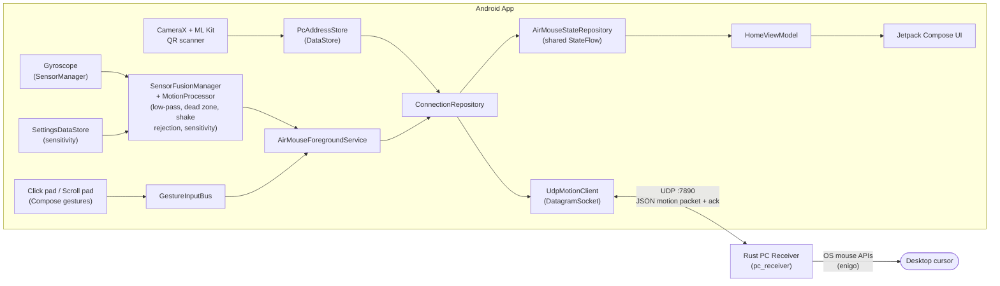
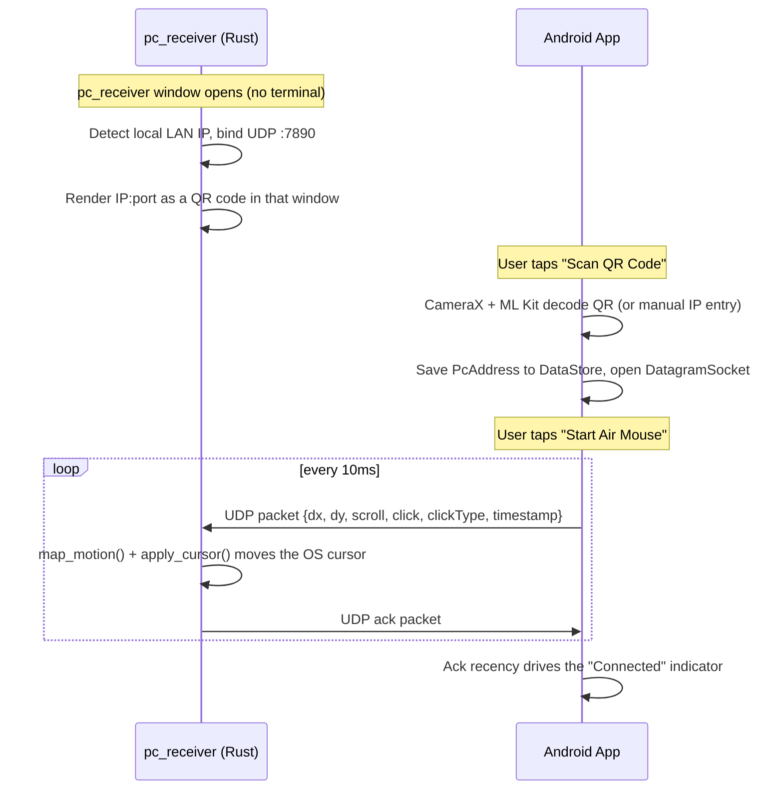

# AirMouse3D — Android App

Turns an Android phone into a wireless air mouse for a desktop over a **direct LAN UDP
connection** to a small Rust receiver (`../pc_receiver`) running on the PC. No Bluetooth, no
cloud, no Firebase — just a QR-code pairing handshake and then raw UDP packets over the same
Wi-Fi network, for the lowest latency a phone-as-mouse setup can realistically get.

> This module previously routed motion through Firebase Realtime Database. That added a cloud
> round-trip (typically 50-200ms+) on every single motion update, which is what made the cursor
> feel laggy and imprecise rather than "exact, like a real mouse" — the whole reason this
> architecture changed. See "Why direct UDP" below.

## Architecture



## Pairing flow



## Why direct UDP

Firebase Realtime Database is a great fit for a lot of things, but every write from the phone
had to round-trip through Google's servers before the PC's poll loop could see it — inherent
latency that no amount of client-side tuning could remove, and the direct cause of the sluggish,
imprecise movement this rewrite fixes. A phone and PC on the same Wi-Fi router are typically a
single LAN hop apart; a direct UDP packet gets there in single-digit milliseconds. UDP specifically
(not TCP) because a dropped mouse-delta packet just means one frame of movement is skipped —
imperceptible — whereas TCP's retransmission-on-loss behavior would introduce exactly the kind
of stutter this is meant to eliminate. This is the same tradeoff real gaming/input protocols make.

Pairing is a one-time QR scan (`ConnectionRepository` + `PcAddressStore` persist the result), not
a manual IP-typing chore every launch — with a manual-entry fallback on the same screen for when
scanning isn't practical. Since UDP gives no delivery confirmation on its own, `pc_receiver` echoes
a tiny ack packet back on every motion packet it receives, and the app's "Connected" state is
driven by ack recency (`ConnectionRepository.isReachable`) rather than blind hope.

### Making it feel like a real mouse (the motion pipeline)

All motion shaping happens once, on the phone, in [`MotionProcessor`](app/src/main/java/com/airmouse3d/sensor/MotionProcessor.kt).
The PC receiver deliberately does **no** second smoothing pass (its old one just stacked a second
filter's lag on top and made the cursor feel mushy) — `mapper.rs` only maps axes and clamps.

Per gyroscope sample the pipeline runs: **shake rejection → 1€ adaptive smoothing → soft dead
zone → pointer acceleration → sensitivity → clamp.** Two pieces do the heavy lifting for feel:

- **One-Euro filter** ([`OneEuroFilter`](app/src/main/java/com/airmouse3d/sensor/OneEuroFilter.kt)):
  an adaptive low-pass (Casiez et al., CHI 2012) that raises its cutoff with signal speed. When
  you're aiming slowly it smooths hard (jitter/tremor gone → rock-steady for fine targeting); when
  you flick, it opens up (minimal lag → the cursor keeps up). A single fixed cutoff — what the code
  used before — can only be steady-but-laggy *or* snappy-but-jittery; this gets both.
- **Pointer acceleration (ballistics):** effective gain grows with hand speed (capped), so slow
  careful tilts stay precise while fast tilts sweep across the screen — exactly how a physical
  mouse behaves through the OS pointer-speed curve. A **soft dead zone** ramps output up from zero
  at the threshold so there's no jump crossing it.

### Tilt direction mapping

The phone lies flat like a physical mouse, screen up, top edge pointing away from you. Motion is
driven by the gyroscope's *rotation rate*, not by tracking the phone sliding across the surface
(accelerometer-only translation tracking drifts within seconds on phone sensors alone — rotation
rate doesn't). The behavior:

- Tilt the phone's **right** edge down (roll right) → cursor **right**; left edge down → left.
- Tilt the **far/top** edge down (pitch forward) → cursor **down**; near edge down → up.

The vertical (up/down) axis is intentionally **inverted** — that was a deliberate change on
request. The signs are derived, not guessed: `MotionProcessor`'s class doc works through Android's
documented gyroscope coordinate system (+X right, +Y toward the top edge, +Z out of the screen,
right-hand-rule rotation) composed with `pc_receiver::cursor::mapper`'s fixed
`screen_x = -dy, screen_y = dx` remap, and the direction unit tests lock each axis's sign in place.

## Firebase → this: UDP packet vs. old document

```
UDP datagram payload (JSON, sent directly to the PC's socket):
{
  "dx": 1.42,
  "dy": -0.31,
  "scroll": 0.0,
  "click": true,
  "clickType": "LEFT",
  "timestamp": 1732200000000
}
```

Field names match `pc_receiver::model::motion_data::MotionPayload` exactly (`click`/`dx`/`dy`/
`timestamp` were already there from the Firebase-era schema; `scroll`/`clickType` are used now
too, since the Rust receiver got extended in this same rewrite to actually act on them).

## Module layout

```
app/src/main/java/com/airmouse3d/
├── AirMouseApplication.kt        # @HiltAndroidApp
├── MainActivity.kt               # single-activity Compose host
├── di/                           # Hilt modules: DataStore, Dispatchers, Repository bindings
├── model/                        # MotionSample, PcAddress, ClickType, AppSettings, AppError, ...
├── sensor/                       # LowPassFilter, MotionProcessor, SensorFusionManager, GestureInputBus
├── net/                          # UdpMotionClient (the raw DatagramSocket + ack listener)
├── repository/                   # ConnectionRepository, SettingsRepository, shared AirMouseStateRepository
├── service/                      # AirMouseForegroundService, NotificationHelper
├── viewmodel/                    # SplashViewModel, HomeViewModel, ScanViewModel, HomeUiState
├── navigation/                   # Screen routes + NavHost graph
├── ui/
│   ├── theme/                    # Color/Type/Theme (Material 3, dynamic color)
│   ├── splash/                   # SplashScreen
│   ├── home/                     # HomeScreen + components (ConnectionHero, click/scroll pads, sensitivity)
│   ├── scan/                     # ScanScreen (CameraX preview + ML Kit QR analyzer + manual entry)
│   └── about/                    # AboutScreen
└── utils/                        # Constants, PcAddressStore, SettingsDataStore, NetworkMonitor, PermissionUtils
```

## Setup

1. Build and run `pc_receiver` (see `../pc_receiver`) — it's a normal desktop app now, just
   double-click the exe. Its window shows a scannable QR code and the same address as plain
   text (`192.168.x.x:7890`).
2. Open `android_app/` in Android Studio and run on a **physical device** with a gyroscope
   (emulators typically don't report real gyroscope data) — on the **same Wi-Fi network** as the PC.
3. On Home, tap **Scan QR Code** and point the camera at the PC's window, or type the address
   shown there into the manual-entry field on the same screen.
4. Tap **Start Air Mouse**. The hero card should turn green ("Connected") within a second or two
   once `pc_receiver` starts echoing acks back.

No Firebase project, no `google-services.json`, no Google account of any kind is needed anymore.

## Permissions

- **Camera** (runtime): to scan the pairing QR code. Not required if you use manual entry instead.
- **Notifications** (runtime, Android 13+): keeps the foreground-service notification visible
  while tracking runs.
- Gyroscope/accelerometer need **no** runtime permission (that only applies to the biometric
  `BODY_SENSORS` group).

## Error handling

`AirMouseForegroundService` reports `AppError.NotPaired` if Start is somehow reached before a PC
is paired, `SensorsUnavailable` if the device has no gyroscope, and relies on
`ConnectionRepository.isReachable`'s ack-timeout to drive a "Searching for PC…" state that
self-heals the moment `pc_receiver` starts answering again — no explicit reconnect logic is
needed, since UDP send is fire-and-forget every tick regardless of whether anyone's listening.

## Tests

`app/src/test/java/com/airmouse3d/sensor/MotionProcessorTest.kt` covers the filtering pipeline in
isolation (rest → zero output, jitter suppression, proportional scaling, shake rejection, reset,
and the per-frame output clamp) with plain JUnit:

```
./gradlew testDebugUnitTest
```
